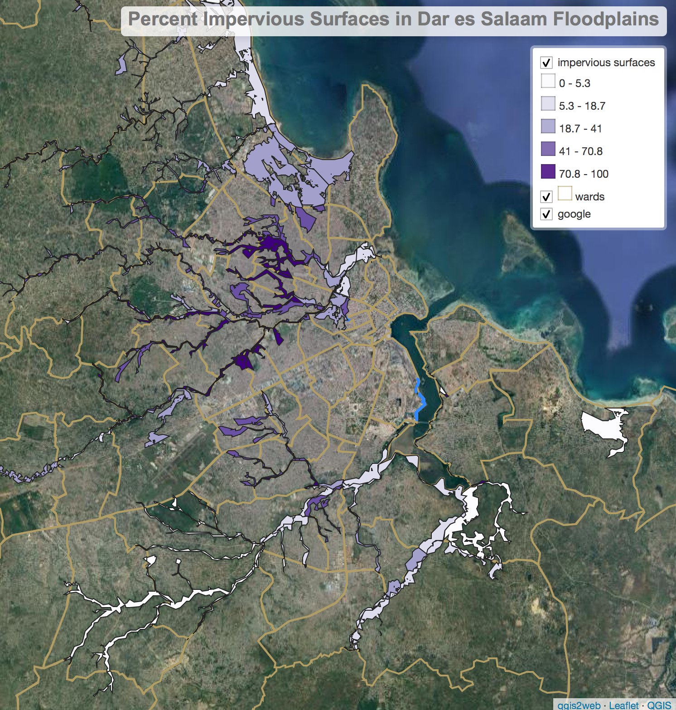

## Question and Overview

This analysis is designed to assess how land cover in flood prone areas may impact urban resilience to climate change in Dar es Salaam, Tanzania. Using [PostGIS](https://postgis.net/) tools with a [PostgreSQL](https://www.postgresql.org/) server, we quantified the amount of impervious land cover relative to the flood prone area of each ward of the city by using building footprints and road centerlines as a proxy for impervious surfaces. We found significant variation in the amount of impervious land cover in flood-prone areas across different wards, with densely populated, coastal areas towards the center of the city having much more heavily developed floodplains. However, since our question was so simple and we encountered significant difficulties performing the analysis, we do not feel that these findings carry much weight.

## Data

The data for this analysis is drawn from [Open Street Map](https://www.openstreetmap.org/) and [Resilience Academy](https://resilienceacademy.ac.tz/), a Tanzania-based project that aims to provide reliable, publicly accessible data and analysis to mitigate the impacts of climate change in developing cities. Both the Open Street Map and Resilience Academy data were created in collaboration with [Ramani Huria](https://ramanihuria.org/en/about-us/), a community mapping project based in Dar es Salaam.

Flood prone areas are derived from [Dar es Salaam Flood Scenario](https://geonode.resilienceacademy.ac.tz/maps/352) data created by Resilience Academy. This layer was created by analyzing a detailed elevation model of the city, and is not based on historic flood events.

[Administrative wards boundaries](https://geonode.resilienceacademy.ac.tz/layers/geonode_data:geonode:dar_es_salaam_administrative_wards) were provided by Resilience Academy. These data were compiled by the National Bureau of Statistics and represent the official boundaries used to collect census data. They were edited by the Ramani Huria team to improve completeness and are generally reliable, though some inconsistencies may remain.

Building footprints and road centerlines were drawn from Open Street Map and prepared by [Joseph Holler](https://github.com/josephholler) using [OSM2PGSQL](https://osm2pgsql.org/). Over the past several years the Ramani Huria project has trained local university student and community members to digitize and tag map features, so the OSM data for Dar es Salaam is much more reliable than it is in many other developing cities. More details about the Ramani Huria project's training and mapping methods can be found [here](https://ramanihuria.org/en/mapping/).


## Methods

### Outline

The raw data is packaged in four separate layers: flood scenarios, city wards, OSM polygons, and OSM roads. After cleaning and reprojecting each layer, we intersected the buildings from the polygons layer and the roads layer with the flood scenarios layer to extract only the roads and buildings within flood-prone areas. We then calculated the area of each of these polygons and grouped them by ward, summarizing the area of roads and buildings separately. Finally, we added these values together and computed the percent impervious land cover by dividing the sum by the total area of the floodplain.

All code needed to complete the analysis is presented below along with a written outline of each section, and can also be viewed in full by downloading [analysis.sql](assets/analysis.sql).

### Data Preparation and Cleaning

We defined flood prone areas as any region with any likely flood depth according to the Resilience Academy flood scenarios layer. Since this definition makes the distinctions between likely flood depths defined by the flood scenarios layer irrelevant, we simplified the data to remove these distinctions. We then reprojected the wards layer and intersected it with the simplified flood layer in order to find the flood prone areas of each ward, and calculated the area of these regions.

```sql
-- dissolve flood geometries to make them simpler - we only care if an area has ANY flood risk
CREATE TABLE floodsimple
AS
SELECT st_union(geom)::geometry(multipolygon,32737) as geom
FROM flood;


-- start out with a fresh copy of the wards layer to mess with
CREATE TABLE dsm_wards as select * from wards

-- reproject wards into an appropriate projected CRS, in this case UTM 37S, EPSG 32737
SELECT addgeometrycolumn('sam','dsm_wards','utmgeom',32737,'MULTIPOLYGON',2);

UPDATE dsm_wards
SET utmgeom = ST_Transform(geom, 32737);

ALTER TABLE dsm_wards
DROP COLUMN geom;


-- intersect wards and flood areas
CREATE TABLE dsm_wards_flood as
SELECT dsm_wards.id, dsm_wards.ward_name, dsm_wards.district_n, dsm_wards.district_c, dsm_wards.area_sqkm, st_multi(st_intersection(dsm_wards.utmgeom, floodsimple.geom))::geometry(multipolygon,32737) as geom
FROM dsm_wards INNER JOIN floodsimple
ON st_intersects(dsm_wards.utmgeom, floodsimple.geom);

-- calculate area of flood prone regions
ALTER TABLE dsm_wards_flood
ADD COLUMN fp_area real;

UPDATE dsm_wards_flood
SET fp_area = st_area(geom) / (1000 * 1000);
```

To prepare the roads data for analysis, we reprojected the layer into the same CRS as the wards and flood plain layers. The roads are defined by their centerlines, so we created a five meter buffer around each feature, making the all roads ten meters wide. While this value is somewhat arbitrary, we chose it with the knowledge that some large roads would be more than ten meters across and many small roads would be less, and that large highways are digitized separately for each direction (meaning that, for example, northbound lanes on a highway would be one feature and southbound lanes would be another), making it more likely that the ten meter width is reasonable for such roads. We decided to buffer by single value in order to simplify the analysis, after having significant trouble dealing with the complicated line features in the raw roads layer. We then clipped the buffered roads by the administrative wards so that only roads within our study area were included in the analysis.

```sql
-- ==================== PREPPING ROADS LAYER ======================

-- copy roads into your schema so you can change it
CREATE TABLE osm_roads AS
SELECT osm_id, way FROM
planet_osm_roads;


-- reproject roads into the appropriate projected CRS, in this case UTM 37S, EPSG 32737
SELECT addgeometrycolumn('sam','osm_roads','utmway',32737,'LineString',2);

UPDATE osm_roads
SET utmway = ST_Transform(way, 32737);

ALTER TABLE osm_roads
DROP COLUMN way;


-- buffer the roads
CREATE TABLE roads_buffered AS
SELECT osm_id, st_buffer(utmway, 5)::geometry(polygon,32737) as geom
FROM osm_roads

ALTER TABLE lab_roads_buffered
DROP COLUMN geom;


-- clip the roads to the wards
CREATE TABLE roads_clipped
AS
SELECT roads_buffered.*, st_multi(st_intersection(roads_buffered.geom, dsm_wards.utmgeom))::geometry(multipolygon, 32737) as geom01
FROM roads_buffered INNER JOIN dsm_wards
ON st_intersects(roads_buffered.geom, dsm_wards.utmgeom);


--drop the old geometries
ALTER TABLE roads_clipped
DROP COLUMN geom;
```

To prepare the buildings layer, we selected all features from the raw OSM polygons with a value for the tag 'building' and reprojected the layer into the appropriate CRS.

```sql
-- ===================== PREPPING BUILDINGS LAYER ============================
-- create buildings layer
CREATE TABLE osm_buildings AS
SELECT osm_id, way
FROM planet_osm_polygon
WHERE  building is not null;

-- reproject buildings
SELECT addgeometrycolumn('sam','osm_buildings','utmway',32737,'polygon',2);

UPDATE osm_buildings
SET utmway = ST_Transform(way, 32737);

ALTER TABLE osm_buildings
DROP COLUMN way;
```


### Overlay Analysis and Aggregation

The analysis was comprised mostly of two simple intersections: that of the buildings layer with the flood scenarios layer and the roads layer with the flood scenarios layer. We spent a  significant amount of time and energy trying to combine the buildings and roads layers, but the sheer size of the buildings layer - over 1.3 million features - made a union operation extremely computationally expensive and we were unable to find a workaround. We manipulated the buildings and roads layers separately for much of the remainder of the analysis, but we performed the same operations on each.

We intersected the buildings and roads with the flood scenarios layer, then calculated the area of each feature in the resulting layers. The intersection of the roads with the flood layer produced some complicated geometry artifacts, which we removed by extracting only the road features with valid polygon or multipolygon geometries.

```sql
-- intersect with flooded areas of each ward
create table flood_buildings as
select dsm_wards_flood.id, osm_buildings.area_sqkm, st_intersection(osm_buildings.utmway, dsm_wards_flood.geom) as geom
from osm_buildings inner join dsm_wards_flood on st_intersects(osm_buildings.utmway, dsm_wards_flood.geom)

create table flood_roads as
  select dsm_wards_flood.id, st_intersection(dsm_wards_flood.geom, roads_clipped.geom01) as geom from
  dsm_wards_flood inner join roads_clipped on st_intersects(dsm_wards_flood.geom, roads_clipped.geom01)

-- fix road geometries
create table flood_rds as
select flood_roads.id, (st_dump(flood_roads.geom)).geom
from flood_roads
where geometrytype(geom) = 'MULTIPOLYGON' or geometrytype(geom) = 'POLYGON'

-- calculate roads area
alter table flood_rds
add column area_sqkm real;

update flood_roads
set area_sqkm = st_area(geom) / (1000000)

-- calculate buildings area
ALTER TABLE osm_buildings
ADD COLUMN area_sqkm real;

UPDATE osm_buildings
SET area_sqkm = st_area(utmway) / (1000 * 1000);
```

We then joined the resulting tables to the flood layer, grouped the results by ward, and calculated the percent impervious land cover.

```sql
-- join floodplain buildings to floodplains layer
create table flood_impervious as
select dsm_wards_flood.id, dsm_wards_flood.ward_name, dsm_wards_flood.fp_area, flood_buildings.area_sqkm from
dsm_wards_flood left join flood_buildings on dsm_wards_flood.id = flood_buildings.id

-- group by ward to sum areas
create table flood_build_grp as
  select id, ward_name, fp_area, sum(area_sqkm) from
  flood_impervious group by id, ward_name, fp_area

-- now do the last two steps again for the roads
create table flood_imperv_rds as
select flood_build_grp.id, flood_build_grp.ward_name, flood_build_grp.fp_area, flood_build_grp.sum, flood_rds.area_sqkm from
flood_build_grp left join flood_rds on flood_build_grp.id = flood_rds.id

create table flood_imperv_grp as
select id, ward_name, fp_area, sum as build_area, sum(area_sqkm) as rds_area from
flood_imperv_rds group by id, ward_name, fp_area, sum


-- add impervious areas and Summarize
alter table flood_imperv_grp
add column imperv_area real,
add column pct_imperv real;

update flood_imperv_grp
set imperv_area = build_area + rds_area;

update flood_imperv_grp
set pct_imperv = (imperv_area / fp_area) * 100;

-- finally, join the results back to the floodplain layer so we can visualize them
create table flood_plains_impervious as
select dsm_wards_flood.ward_name, dsm_wards_flood.geom, flood_imperv_grp.fp_area, flood_imperv_grp.imperv_area, flood_imperv_grp.pct_imperv from
dsm_wards_flood left join flood_imperv_grp on dsm_wards_flood.id = flood_imperv_grp.id
```


## Results


A web map summarizing our results is available [here](assets/qgis2web_2021_04_06-22_47_19_571538). Our SQL query yielded mixed results. While we were successful in reaching a result, a closer inspection of the results shows that our calculated percentage of impervious area per floodplain is pretty misleading. We had difficulty successfully unioning our impervious surfaces together, which led to an overestimation of impervious surfaces in some instances. For example, the ward of Kariakoo had a 261% impervious surface, which is impossible. This ward has a small sliver of floodplain in its western border, with a road running right through it. We also made a blanket categorization about the width of all the roads in Dar es Salaam in our buffer step, which could over or underestimate the total percentage of impervious surface.

While we had difficulty adjusting to the new software environment of SQL, we recognize its value in allowing us to work with large data sets that would be impossible to analyze in desktop GIS. We feel that spending more time with SQL and query-based analysis would have improved both the quality of our analysis and its value as an educational tool for future users of this software - we spent so much time troubleshooting errors that we were left with little time to make our analysis more robust or optimize it by constructing compound queries. While our results are not as meaningful or significant as we had hoped, the experience of designing and implementing the analysis was valuable and we look forward to getting more experience with spatial SQL.
