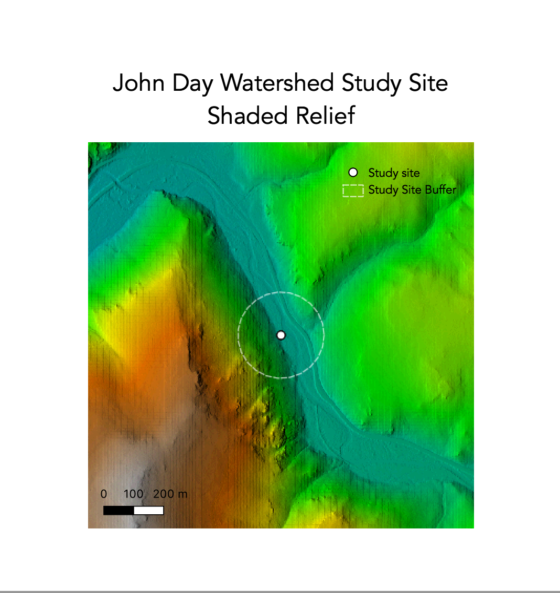
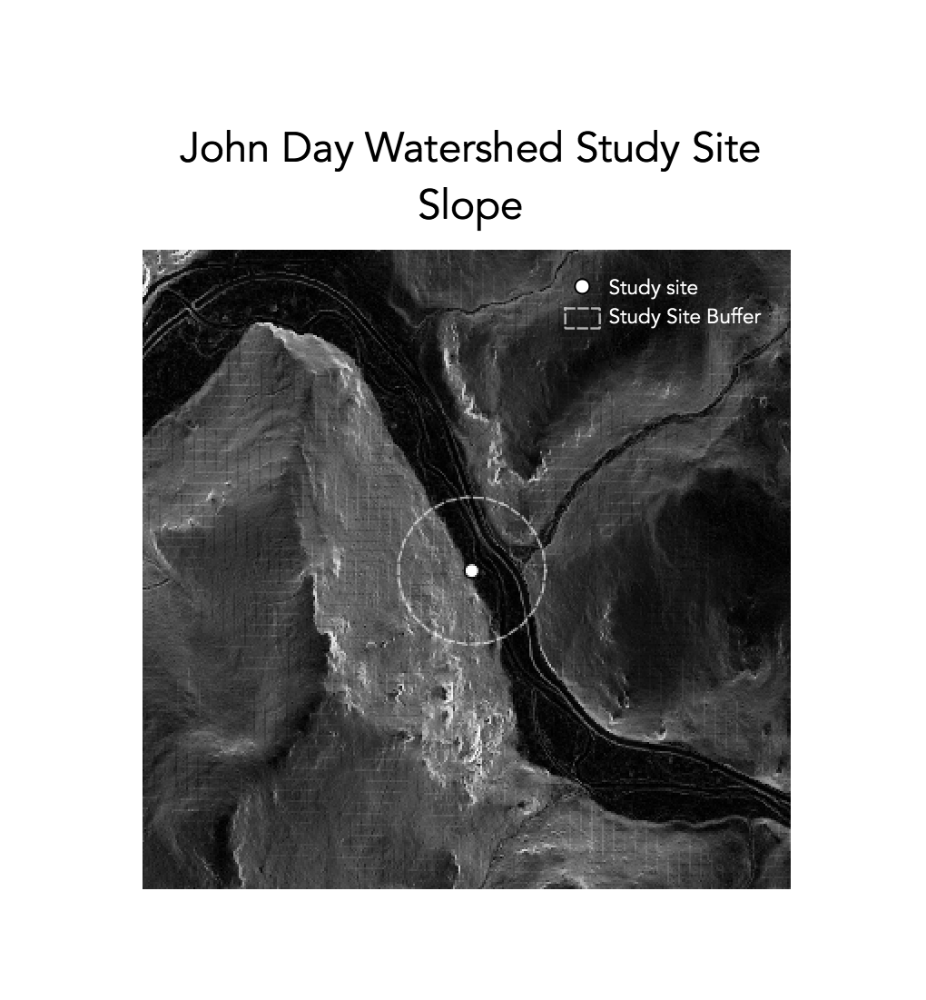
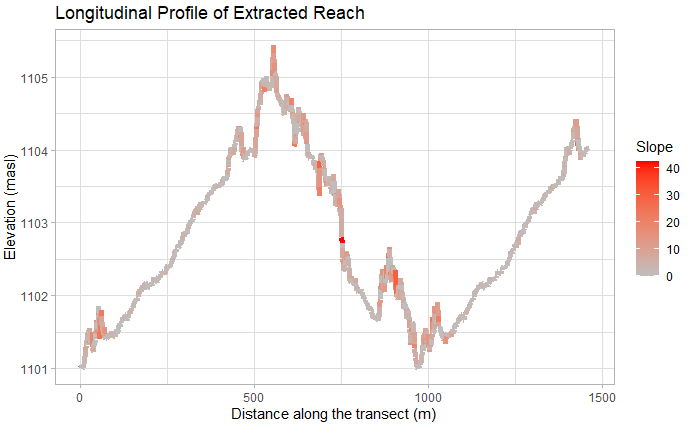
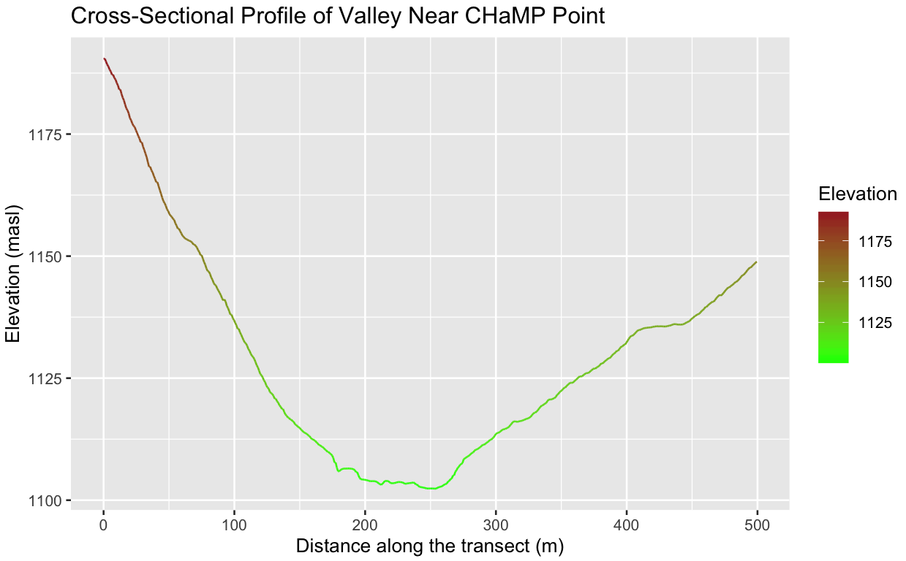

**Replication of**
# A classification of natural rivers

Original study *by* Rosgen, D. L.
*in* *CATENA* 22 (3):169–199. https://linkinghub.elsevier.com/retrieve/pii/0341816294900019.

and Replication by: Kasprak, A., N. Hough-Snee, T. Beechie, N. Bouwes, G. Brierley, R. Camp, K. Fryirs, H. Imaki, M. Jensen, G. O’Brien, D. Rosgen, and J. Wheaton. 2016. The Blurred Line between Form and Process: A Comparison of Stream Channel Classification Frameworks ed. J. A. Jones. *PLOS ONE* 11 (3):e0150293. https://dx.plos.org/10.1371/journal.pone.0150293.

Replication Authors:
Hannah Rigdon, Zach Hilgendorf, Joseph Holler, and Peter Kedron.

Replication Materials Available at: [github repository name](github repository link)

Created: `23 March 2021`
Revised: `23 March 2021`

## Abstract
The complexity of river systems pose a challenge for reproducible and transferable science, yet a common framework for describing hydrological systems is crucial to the success of watershed management, land use planning, natural hazard mitigation and much more. Rosgen's original study (1994) lays out a river classification system that seeks to standardize language and frame of reference for those working with river systems across disciplines. Rosgen's system focuses on sinuosity, entrenchment, and width of flood-prone areas to define 7 major river classes that are then broken down into Level II classifications based on slope and channel material. Kasprak et. al (2016) set out to implement the Rosgen classification system, in addition to others, to see how the different schemes compared and where they diverged. They used DEM data and field measurements  from the Middle Fork John Day Basin, which is a watershed of high conservation interest in the Columbia River Basin. Our study set out to test the reproducibility of both of these studies with GIS tools to see if river classification schemes could be successfully implemented without having to rely on site-specific field data, which would make river classification a much easier and accessible task.  

### Sampling Plan and Data Description
For the replication of the Kasprak study, each student in GEOG0323 Open Source GIS was randomly assigned a study location from the 33 study locations analyzed by Kasprak et al 2016. The 33 study sites were originally chosen by Kasprak et al. from a stratified sampling of CHaMP data surveys conducted in 2012 and 2013.

## Materials and Procedure
This analysis was replicated using entirely open source software. We used a combination of GRASS, QGIS 3.16 LTR, and RStudio. It is unclear what software was used in the Kasprak et al study, but it is assumed to be proprietary software. Our analysis also used a  1m LiDAR-derived DEM in place of field measurements to calculate our terrain-based metrics.

My location was the study site identified by loc_id = 9 in the Columbia Habitat and Monitoring Program (CHaMP) [dataset.](https://github.com/hrigdon98/RE-rosgen/tree/main/data/raw/public).

Code and materials are available in this GitHub [repository](https://github.com/hrigdon98/RE-rosgen).

A detailed outline of GRASS procedures can be found [here](https://github.com/hrigdon98/RE-rosgen/blob/main/procedure/protocols/1-Research_Protocol_GRASS.pdf). We used the models linked below to automate steps for loading and visualizing the data as well as averaging our digitized banks and valleys into centerlines.

Models:
- [Visualization](https://github.com/hrigdon98/RE-rosgen/blob/main/procedure/code/visualize.gxm)
- [Center Line calculations](https://github.com/hrigdon98/RE-rosgen/blob/main/procedure/code/center_line_length.gxm)

We then moved into RStudio and further analyzed our data to graph longitudinal profiles and cross-section analyses, following this [R markdown document](https://github.com/hrigdon98/RE-rosgen/blob/main/procedure/code/2-ProfileViewer.Rmd).

While our procedures were pretty similar to those of the Kasprak et al study, there are a few key differences. This analysis, as stated, relied entirely on open source software, so our calculations of values in Table 2 have a little more subjectivity than those that could be produced by a proprietary GIS tool. The other important difference is the resolution of our DEM data. The Kasprak study used elevation data with a resolution of 0.1 meters, whereas our DEM was 1m. Although you can see some artifacts in the shaded relief, 1m is still an incredibly fine resolution and shouldn't affect the outcome of our results.

## Replication Results

Table 1. Site Measurements (in meters)

| Variable | Value | Source |

| :---: | :---: | :---: |
| Bankfull Width | 9.8264 | CHaMP_Data_MFJD |
| Bankfull Depth Average  | 0.4114 | Dpth_Avg in CHaMP_Data_MFJD |
| Bankfull Depth Max | 0.8571 | Dpth_Max in CHaMP_Data_MFJD |
| Valley Width  | 500 | Cross-section profile |
| Valley Depth | 1.7142 | 2x Bankfull Depth Max |
| Stream/River Length | 265 | GRASS measurement of bank centerline |
| Valley Length | 280.157387 | GRASS measurement of valley centerline |
| Median Channel Material Particle Diameter | 67 | SubD50 in CHaMP_Data_MFJD  |

Table 2. Rosgen Level I Classification

| Criteria | Value |

| :---: |:---: |
| Entrenchment Ratio | 50.89 |
| Width / Depth Ratio | 23.88526981 |
| Sinuosity | 0.95 |
| Level I Stream Type | C |

Table 3. Rosgen Level II Classification

| Criteria | Value |

| :---: | :---: |
| Slope | 0.002 |
| Channel Material | Gravel |
| Level II Stream Type | C4b |

## Discussion

The results of this one analysis suggest that there is potential to accurately conduct river classifications remotely using open source GIS methods, but room for improvement. My own analysis was in agreement with the Kasprak analysis that this particular point should be classified as C4b. Our results differed the most in the calculation of the sinuosity, which can probably be attributed to human error in digitizing the stream and valley centerlines. I would expect that field measurements would be more robust. However, my calculations were only off by 0.2, which is still within the scope of flexibility of the Rosgen classification. I would need to see the results of my classmates before I could confidently point to my results as proof that this is a reproducible and generalizable workflow for the classification of other watershed and river systems. There are also a couple gaps in consistency and accuracy that make me hesitant to accept my results as a successful replication of the Kasprak study.

First of all, there are some temporal inconsistencies in the data that we used that give me pause. The CHaMP data surveyed this study location four different times from 2012-2017. The point I randomly selected was from 2017 had a Rosgen classification of C4b, but each of the 4 points had a different Rosgen classification each time it was surveyed. This either points to some inconsistency in the methods of the Kasprak study or shows just how dynamic river systems are, or a combination of both. Therefore, the temporal difference between when the elevation data was collected in 2008 and when the CHaMPS surveys were conducted seems like a significant source of inconsistency in this analysis.

There was also a certain amount of subjectivity in the heads-up digitizing of the stream banks and valley lines. The analysis attempted to control for bias by alternating between digitizing banks and valleys, as well as alternating between slope and hillshade layers underneath, but I'm not sure how much bias that actually removed. I think that someone with more experience identifying stream banks and river valleys could digitize a little more accurately. However, it does not seem like that generated enough of an error to discredit the results of this analysis.

## Conclusion
Overall, this analysis was successful in replicating the results of [Kasprak et al (2016)](https://journals.plos.org/plosone/article?id=10.1371/journal.pone.0150293). The results of this analysis suggest that GIS can potentially be used as a tool for river classifications. This is an exciting possibility, as resources and accessibility of field measurements are often a barrier to conducting river classifications, and the results of this workflow suggest that this method could be implemented to perform river classifications in place of field measurements. However, this was an analysis conducted on one study site, out of 33, so these results should not be generalized for the whole dataset. There is still significant temporal discrepancy between the collection of the LiDAR data and the CHaMP survey that should be addressed before the scope of this analysis is expanded further.

## References

1. Rosgen, D. L. 1994. A classification of natural rivers. CATENA 22 (3):169–199. https://linkinghub.elsevier.com/retrieve/pii/0341816294900019.
1. Kasprak, A., N. Hough-Snee, T. Beechie, N. Bouwes, G. Brierley, R. Camp, K. Fryirs, H. Imaki, M. Jensen, G. O’Brien, D. Rosgen, and J. Wheaton. 2016. The blurred line between form and process: A comparison of stream channel classification frameworks ed. J. A. Jones. PLOS ONE 11 (3):e0150293. https://dx.plos.org/10.1371/journal.pone.0150293.

####  Report Template References & License

This template was developed by Peter Kedron and Joseph Holler with funding support from HEGS-2049837. This template is an adaptation of the ReScience Article Template Developed by N.P Rougier, released under a GPL version 3 license and available here: https://github.com/ReScience/template. Copyright © Nicolas Rougier and coauthors. It also draws inspiration from the pre-registration protocol of the Open Science Framework and the replication studies of Camerer et al. (2016, 2018). See https://osf.io/pfdyw/ and https://osf.io/bzm54/

Camerer, C. F., A. Dreber, E. Forsell, T.-H. Ho, J. Huber, M. Johannesson, M. Kirchler, J. Almenberg, A. Altmejd, T. Chan, E. Heikensten, F. Holzmeister, T. Imai, S. Isaksson, G. Nave, T. Pfeiffer, M. Razen, and H. Wu. 2016. Evaluating replicability of laboratory experiments in economics. Science 351 (6280):1433–1436. https://www.sciencemag.org/lookup/doi/10.1126/science.aaf0918.

Camerer, C. F., A. Dreber, F. Holzmeister, T.-H. Ho, J. Huber, M. Johannesson, M. Kirchler, G. Nave, B. A. Nosek, T. Pfeiffer, A. Altmejd, N. Buttrick, T. Chan, Y. Chen, E. Forsell, A. Gampa, E. Heikensten, L. Hummer, T. Imai, S. Isaksson, D. Manfredi, J. Rose, E.-J. Wagenmakers, and H. Wu. 2018. Evaluating the replicability of social science experiments in Nature and Science between 2010 and 2015. Nature Human Behaviour 2 (9):637–644. http://www.nature.com/articles/s41562-018-0399-z.
